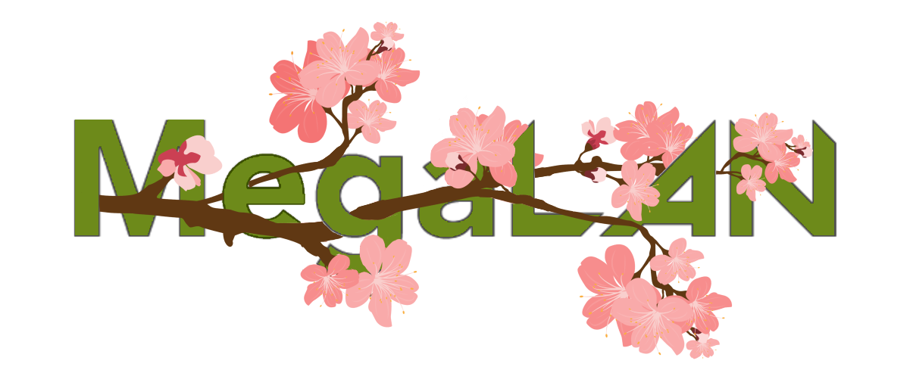

# 🌸 MegaLAN Full Blossom Quests Website

A Stamp Rally Website Developed for MegaLAN Full Blossom during September 2023

## 🌼 Team

### 🧑‍💻 Leads

- [Vishnu](https://github.com/VishnuPrateek1)
- [Hari](https://hari-portfolio-ten.vercel.app)

### 💻 Development

- [Max](https://github.com/max8539)
- [Isaac](https://github.com/Gyoumi)

### 🎨 Design

- Renee
- [Christine](https://github.com/Christin322)

## 🍃 Documentation

You can our video on how to use it as an admin here: [Documentation](https://youtu.be/ayUnhIeEo9k)

The website is available here: [Website](https://www.quests.megalan.com.au/)

## 🌺 Tech Stack

This is a [T3 Stack](https://create.t3.gg/) project bootstrapped with `create-t3-app`.

- [Next.js](https://nextjs.org)
- [NextAuth.js](https://next-auth.js.org)
- [Prisma](https://prisma.io)
- [Tailwind CSS](https://tailwindcss.com)
- [tRPC](https://trpc.io)
- Typescript

## 🌄 Deployment

Deployed using `Vercel` and `Supabase` for free,

I ❤️ Free Hosting.
